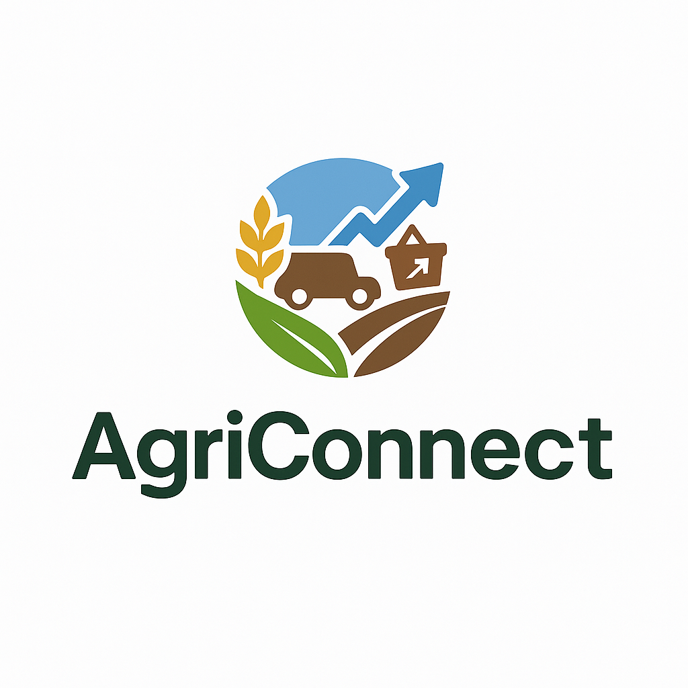

# AgriConnect

<div align="center">
  
  <h3>Connecter les agriculteurs du Sénégal</h3>
</div>

## 📱 Overview

AgriConnect is a mobile marketplace designed to connect farmers, buyers, and agricultural stakeholders across West Africa. The platform enables direct trading of agricultural products, provides market price insights, and facilitates communication between users.

Built with React Native and Expo, AgriConnect works on both iOS and Android devices, with web support for broader accessibility.

## ✨ Features

### For Farmers & Sellers
- **Product Listings**: Post agricultural products with detailed descriptions, pricing, and availability
- **Flexible Delivery Options**: Offer local pickup or delivery services
- **Location-Based Visibility**: Increase visibility to nearby buyers
- **Direct Messaging**: Communicate directly with potential buyers

### For Buyers
- **Product Discovery**: Browse agricultural products by category or location
- **Search & Filter**: Find specific products based on various criteria
- **Market Price Insights**: Access current and historical price trends
- **Saved Favorites**: Keep track of interesting listings

### Market Insights
- **Price Trends**: View price trends for agricultural products
- **Contribute Data**: Submit current market prices to help the community
- **Regional Comparisons**: Compare prices across different regions

## 🛠️ Tech Stack

- **Frontend**:
  - React Native / Expo
  - TypeScript
  - Expo Router for navigation
  - Zustand for state management
  - React Query for data fetching

- **Backend**:
  - Hono.js (Node.js framework)
  - tRPC for type-safe API
  - Supabase for database and authentication

- **Other Tools**:
  - Expo Camera for image capture
  - Expo Location for geolocation services
  - AsyncStorage for local data persistence

## 🚀 Getting Started

### Prerequisites

- Node.js (v16 or newer)
- Bun or npm
- Expo CLI
- iOS Simulator / Android Emulator (optional for mobile development)

### Installation

1. Clone the repository:
   ```bash
   git clone https://github.com/yourusername/agriconnect.git
   cd agriconnect
   ```

2. Install dependencies:
   ```bash
   bun install
   # or
   npm install
   ```

3. Set up environment variables:
   ```bash
   cp .env.example .env
   ```
   Edit the `.env` file with your Supabase credentials and other required variables.

### Running the App

#### Development

```bash
# Start the development server with tunnel
bun start

# Start with web support
bun start-web

# Start with debugging enabled
bun start-web-dev
```

#### Using Expo Go

1. Install the Expo Go app on your iOS or Android device
2. Scan the QR code displayed in the terminal after running `bun start`

## 📁 Project Structure

```
agriconnect/
├── app/                    # Application screens and navigation
│   ├── (tabs)/             # Tab-based navigation screens
│   ├── auth/               # Authentication screens
│   ├── products/           # Product detail screens
│   ├── chat/               # Chat screens
│   └── _layout.tsx         # Root layout configuration
├── assets/                 # Static assets (images, fonts)
├── backend/                # Backend API code
│   ├── hono.ts             # Hono.js server setup
│   └── trpc/               # tRPC router and procedures
├── components/             # Reusable UI components
├── constants/              # Application constants
├── lib/                    # Utility libraries
├── stores/                 # Zustand stores
└── types/                  # TypeScript type definitions
```

## 🔑 Key Features Implementation

### Authentication

The app uses Supabase for authentication with JWT tokens. Users can register, login, and manage their profiles.

### Product Listings

Products are categorized and can be filtered by location, price, and other attributes. Each listing includes:
- Title and description
- Price and negotiation status
- Quantity and unit
- Location information
- Delivery options
- Availability dates

### Geolocation

The app uses Expo Location to:
- Determine user's current location
- Show nearby products
- Calculate distances between buyers and sellers

### Market Trends

Users can contribute price data for agricultural products, which is aggregated to show:
- Current average prices
- Historical price trends
- Regional price differences

## 🌐 API Documentation

The backend uses tRPC for type-safe API endpoints:

- **auth**: User authentication and registration
- **products**: CRUD operations for product listings
- **users**: User profile management
- **messages**: Chat functionality
- **marketTrends**: Market price data

## 🤝 Contributing

Contributions are welcome! Please feel free to submit a Pull Request.

1. Fork the repository
2. Create your feature branch (`git checkout -b feature/amazing-feature`)
3. Commit your changes (`git commit -m 'Add some amazing feature'`)
4. Push to the branch (`git push origin feature/amazing-feature`)
5. Open a Pull Request

## 📄 License

This project is licensed under the MIT License - see the LICENSE file for details.

## 📞 Contact

For questions or support, please contact [your-email@example.com](mailto:your-email@example.com).

---

<div align="center">
  <p>Built with ❤️ for West African farmers</p>
</div>